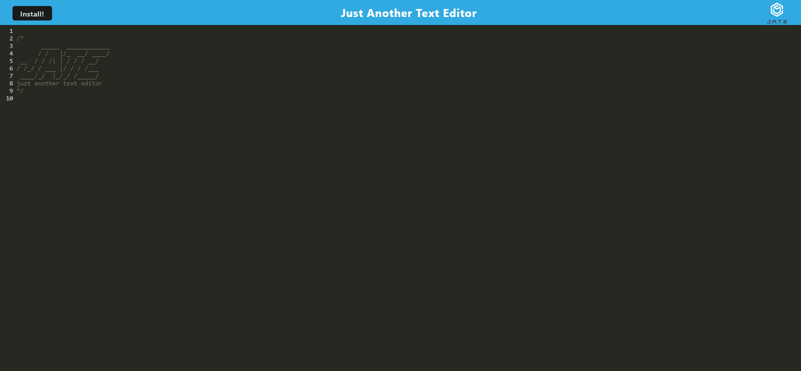

# Scratch

## Table of Contents
 - [Description](#description)
 - [Installation](#installation)
 - [Usage](#usage)
 - [Contributing](#contributing)
 - [Testing](#testing)
 - [Contact](#contact)
 - [License](#license)

## Description
I wanted to make a progressive web application that allows the user to use a text editor either in the browser or offline/installed. It uses React and bundles all of my resource files automatically on build.

## Installation
run "npm run install", then "npm run start". This should install all dependencies and build before starting the server.

## Usage
Check out the application at its heroku deployment [HERE](https://scratch-bb4b4774f119.herokuapp.com/)  
To install the program to your desktop, hit the "Install" button in the top left corner. 
  
Other than that, it is a fairly standard text editor.

## Contributing
Be good and do code.

## Testing
Use Jest or another test suite to test the app

- GitHub Profile: [IkonicRes](https://github.com/IkonicRes)

- For additional questions, reach out to IkonicResonance@gmail.com.

## Contact

Preferred method of communication: Email

## License

MIT License

    Permission is hereby granted, free of charge, to any person obtaining a copy of this software and associated documentation files (the "Software"), to deal in the Software without restriction, including without limitation the rights to use, copy, modify, merge, publish, distribute, sublicense, and/or sell copies of the Software, and to permit persons to whom the Software is furnished to do so, subject to the following conditions: The above copyright notice and this permission notice shall be included in all copies or substantial portions of the Software. THE SOFTWARE IS PROVIDED "AS IS", WITHOUT WARRANTY OF ANY KIND, EXPRESS OR IMPLIED, INCLUDING BUT NOT LIMITED TO THE WARRANTIES OF MERCHANTABILITY, FITNESS FOR A PARTICULAR PURPOSE AND NONINFRINGEMENT. IN NO EVENT SHALL THE AUTHORS OR COPYRIGHT HOLDERS BE LIABLE FOR ANY CLAIM, DAMAGES OR OTHER LIABILITY, WHETHER IN AN ACTION OF CONTRACT, TORT OR OTHERWISE, ARISING FROM, OUT OF OR IN CONNECTION WITH THE SOFTWARE OR THE USE OR OTHER DEALINGS IN THE SOFTWARE.

